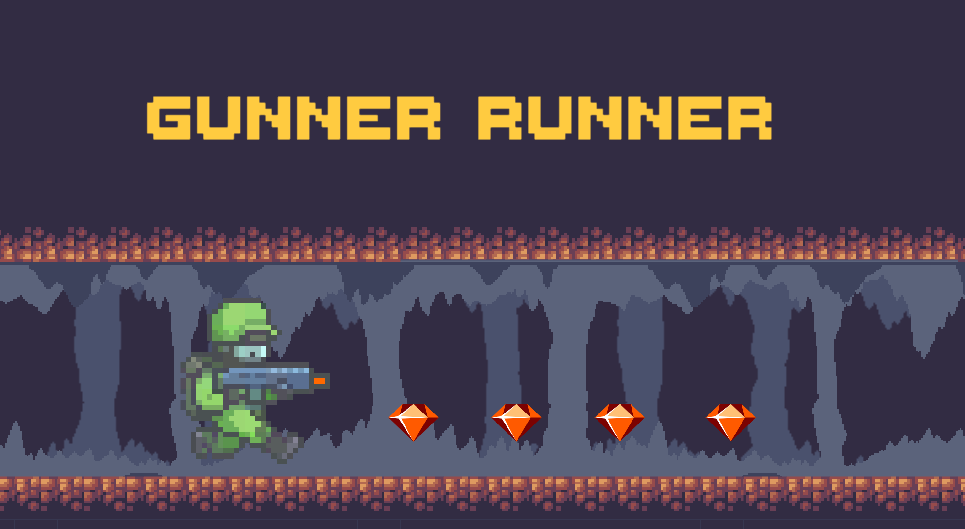
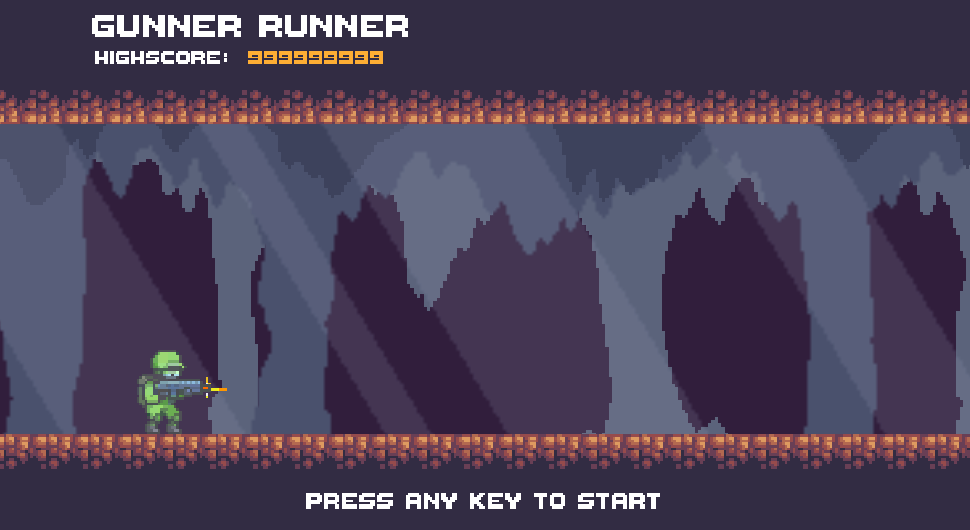

[![Contributors][contributors-shield]][contributors-url]
[![MIT License][license-shield]][license-url]
[![LinkedIn][linkedin-shield]][linkedin-url]

<!-- PROJECT LOGO -->
 

  

<h2 align="center">Infinite Runner</h2>
  

    <a href="https://github.com/RodrigoQuiroz09/Infinite-Runner"><strong>View APK</strong></a>
    ·
    <a href="https://github.com/RodrigoQuiroz09/Infinite-Runner/tree/main/docs"><strong>Explore the GDD</strong></a>

  

<!-- TABLE OF CONTENTS -->

  
Table of Contents

  <ol>
    <li>
      <a href="#about-the-project">About The Project</a>
      <ul>
        <li><a href="#built-with">Built With</a></li>
        <li><a href="#external-tools">External Tools</a></li>
      </ul>
    </li>
    <li>
      <a href="#requirements">Requirements</a>
    </li>
    <li><a href="#gameplay-controls">Gameplay Controls</a></li>
    <li><a href="#roadmap">Roadmap</a></li>
    <li><a href="#contributing">Contributing</a></li>
    <li><a href="#acknowledgments">Acknowledgments</a></li>
  </ol>

<!-- ABOUT THE PROJECT -->

## About The Project

- Personal project only to show on portfolio
- A small scoped mobile game planned to be as a starting point for future projects and practice skills to be a game developer in Unity. It is meant to be for casual mobile-game players with a endless runner typo gameplay.

### Pitch

- A scientist who seeks to escape from a underground facility and must make his way through platforms, shooting his enemies, jumping over obstacles.

(<a href="#top">back to top</a>)

### Built With

- [![Unity][unity.com]][unity-url]
- [![C#][csharp.com]][csharp-url]
- [![NET#][net.com]][net-url]

### External tools

- [![Unity][unity-a.com]][unity-a-url]
- [![itchio][itchio.com]][itchio-url]
- [![Notion][notion.com]][notion-url]
- [![VSCode][vsc.com]][vsc-url]
  - <strong>Core Extensions</strong>
  - C# XML Documentation Comments
  - C# v1.24.4
  
(<a href="#top">back to top</a>)

<!-- GETTING STARTED -->

## Requirements

- Unity Version 2020.2.12f1 or Newer
- C# Programming Language
- [DoTween Library](http://dotween.demigiant.com/index.php)
- Text Mesh Pro (Unity Library)

(<a href="#top">back to top</a>)

<!-- USAGE EXAMPLES -->

## Gameplay Controls

<table>
  <tr>
    <td>Mobile Controls</td>
     <td>PC Controls</td>
  </tr>
  <tr>
    <td></td>
    <td></td>
  </tr>
 </table>

_For more explanation, please refer to the [Documentation](https://github.com/RodrigoQuiroz09/Infinite-Runner/tree/main/docs)_

(<a href="#top">back to top</a>)

<!-- ROADMAP -->

## Roadmap

- Tilemap Config And Base Scenario for testing movement
- Parallax and infinite scenario
- Design of different platforms for random generation
- Basic Mechanics Player
  - Jumping
  - Shooting
- Mapping for mobile devices
- Life System
- Enemies and AI
- Pickable Objects
- Ui and points system

See the [Notion To-Do list](https://silicon-grill-d89.notion.site/ec3575c8e0b74b8891632f8c6656f194?v=fa412af091e24c8ba0b07a61a53d696c) for a full list of proposed features (and known issues).

(<a href="#top">back to top</a>)

<!-- CONTRIBUTING -->

## Contributing

This is a open source game, everyone is invited to take the project as starting project or for reference in certain mechanics.

(<a href="#top">back to top</a>)

<!-- ACKNOWLEDGMENTS -->

## Acknowledgments and Assets

- [The Dungeon Pack - Parallax Background](https://pixfinity.itch.io/the-dungeon-pack)
- [GUNNER - ANIMATED CHARACTER](https://secrethideout.itch.io/team-wars-platformer-battle)
- [Animated Explosions](https://opengameart.org/content/animated-explosions)
- [Simple Heart Health System](https://assetstore.unity.com/packages/tools/gui/simple-heart-health-system-120676)
- [Free Pixel Font - Thaleah](https://assetstore.unity.com/packages/2d/fonts/free-pixel-font-thaleah-140059)
- [Free Game Items](https://assetstore.unity.com/packages/2d/environments/free-game-items-131764)
- [Sunny Land](https://assetstore.unity.com/packages/2d/characters/sunny-land-103349)

(<a href="#top">back to top</a>)

<!-- MARKDOWN LINKS & IMAGES -->
<!-- https://www.markdownguide.org/basic-syntax/#reference-style-links -->

[contributors-shield]: https://img.shields.io/github/contributors/RodrigoQuiroz09/Infinite-Runner.svg?style=for-the-badge
[contributors-url]: https://github.com/RodrigoQuiroz09/Infinite-Runner/graphs/contributors
[license-shield]: https://img.shields.io/github/license/RodrigoQuiroz09/Infinite-Runner.svg?style=for-the-badge
[license-url]: https://github.com/RodrigoQuiroz09/Infinite-Runner/blob/master/LICENSE.txt
[linkedin-shield]: https://img.shields.io/badge/-LinkedIn-black.svg?style=for-the-badge&logo=linkedin&colorB=555
[linkedin-url]: https://linkedin.com/in/linkedin_username
[product-screenshot]: images/mainmenu.PNG
[unity-url]: https://unity.com
[unity.com]: https://img.shields.io/badge/Unity-100000?style=for-the-badge&logo=unity&logoColor=white
[unity-a-url]: https://assetstore.unity.com
[unity-a.com]: https://img.shields.io/badge/Unity-Asset-Store?style=for-the-badge&logo=unity&logoColor=white
[csharp-url]: https://docs.microsoft.com/en-us/dotnet/csharp/
[csharp.com]: https://img.shields.io/badge/C%23-239120?style=for-the-badge&logo=c-sharp&logoColor=white
[notion-url]: https://www.notion.so/product?fredir=1
[notion.com]: https://img.shields.io/badge/Notion-000000?style=for-the-badge&logo=notion&logoColor=white
[vsc-url]: https://code.visualstudio.com
[vsc.com]: https://img.shields.io/badge/Visual_Studio_Code-0078D4?style=for-the-badge&logo=visual%20studio%20code&logoColor=white
[net-url]: https://dotnet.microsoft.com/en-us/
[net.com]: https://img.shields.io/badge/.NET-5C2D91?style=for-the-badge&logo=.net&logoColor=white
[itchio-url]: https://itch.io
[itchio.com]: https://img.shields.io/badge/Itch.io-FA5C5C?style=for-the-badge&logo=itchdotio&logoColor=white
