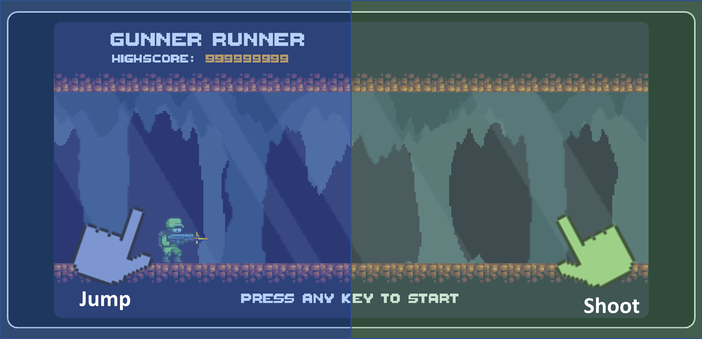
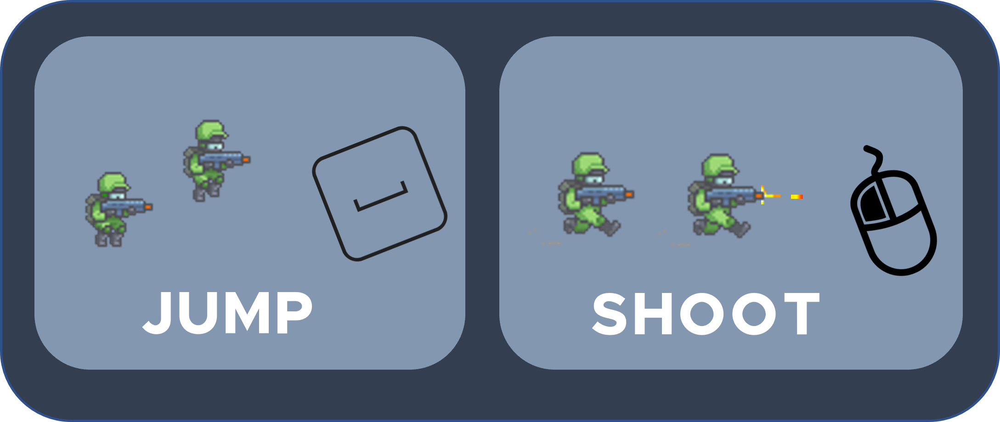

[![Contributors][contributors-shield]][contributors-url]
[![MIT License][license-shield]][license-url]
[![LinkedIn][linkedin-shield]][linkedin-url]
[![forthebadge](data:image/svg+xml;base64,PHN2ZyB4bWxucz0iaHR0cDovL3d3dy53My5vcmcvMjAwMC9zdmciIHdpZHRoPSIxNTUuMzUiIGhlaWdodD0iMzUiIHZpZXdCb3g9IjAgMCAxNTUuMzUgMzUiPjxyZWN0IGNsYXNzPSJzdmdfX3JlY3QiIHg9IjAiIHk9IjAiIHdpZHRoPSI4OC44NSIgaGVpZ2h0PSIzNSIgZmlsbD0iIzMxQzRGMyIvPjxyZWN0IGNsYXNzPSJzdmdfX3JlY3QiIHg9Ijg2Ljg1IiB5PSIwIiB3aWR0aD0iNjguNSIgaGVpZ2h0PSIzNSIgZmlsbD0iIzM4OUFENSIvPjxwYXRoIGNsYXNzPSJzdmdfX3RleHQiIGQ9Ik0xMy43OCAxOS40MkwxMy43OCAxOS40MkwxNS4yNyAxOS40MlExNS4yNyAyMC4xNSAxNS43NSAyMC41NVExNi4yMyAyMC45NSAxNy4xMiAyMC45NUwxNy4xMiAyMC45NVExNy45MCAyMC45NSAxOC4yOSAyMC42M1ExOC42OCAyMC4zMiAxOC42OCAxOS44MEwxOC42OCAxOS44MFExOC42OCAxOS4yNCAxOC4yOCAxOC45NFExNy44OSAxOC42MyAxNi44NSAxOC4zMlExNS44MiAxOC4wMSAxNS4yMSAxNy42M0wxNS4yMSAxNy42M1ExNC4wNSAxNi45MCAxNC4wNSAxNS43MkwxNC4wNSAxNS43MlExNC4wNSAxNC42OSAxNC44OSAxNC4wMlExNS43MyAxMy4zNSAxNy4wNyAxMy4zNUwxNy4wNyAxMy4zNVExNy45NiAxMy4zNSAxOC42NiAxMy42OFExOS4zNiAxNC4wMSAxOS43NSAxNC42MVEyMC4xNSAxNS4yMiAyMC4xNSAxNS45NkwyMC4xNSAxNS45NkwxOC42OCAxNS45NlExOC42OCAxNS4yOSAxOC4yNiAxNC45MVExNy44NCAxNC41NCAxNy4wNiAxNC41NEwxNy4wNiAxNC41NFExNi4zMyAxNC41NCAxNS45MyAxNC44NVExNS41MyAxNS4xNiAxNS41MyAxNS43MUwxNS41MyAxNS43MVExNS41MyAxNi4xOCAxNS45NiAxNi41MFExNi40MCAxNi44MSAxNy4zOSAxNy4xMFExOC4zOSAxNy40MCAxOC45OSAxNy43OFExOS42MCAxOC4xNiAxOS44OCAxOC42NVEyMC4xNiAxOS4xMyAyMC4xNiAxOS43OUwyMC4xNiAxOS43OVEyMC4xNiAyMC44NiAxOS4zNCAyMS40OVExOC41MiAyMi4xMiAxNy4xMiAyMi4xMkwxNy4xMiAyMi4xMlExNi4yMCAyMi4xMiAxNS40MiAyMS43N1ExNC42NCAyMS40MyAxNC4yMSAyMC44M1ExMy43OCAyMC4yMiAxMy43OCAxOS40MlpNMjUuMjMgMjJMMjMuNjkgMjJMMjYuOTEgMTMuNDdMMjguMjQgMTMuNDdMMzEuNDcgMjJMMjkuOTIgMjJMMjkuMjIgMjAuMDFMMjUuOTIgMjAuMDFMMjUuMjMgMjJaTTI3LjU3IDE1LjI4TDI2LjMzIDE4LjgyTDI4LjgxIDE4LjgyTDI3LjU3IDE1LjI4Wk0zNi45MCAyMkwzNS40MiAyMkwzNS40MiAxMy40N0wzNy4zNCAxMy40N0wzOS44MSAyMC4wMUw0Mi4yNiAxMy40N0w0NC4xOCAxMy40N0w0NC4xOCAyMkw0Mi43MCAyMkw0Mi43MCAxOS4xOUw0Mi44NSAxNS40M0w0MC4zMyAyMkwzOS4yNyAyMkwzNi43NSAxNS40M0wzNi45MCAxOS4xOUwzNi45MCAyMlpNNTAuNDAgMjJMNDguOTIgMjJMNDguOTIgMTMuNDdMNTIuMTggMTMuNDdRNTMuNjEgMTMuNDcgNTQuNDUgMTQuMjFRNTUuMjkgMTQuOTYgNTUuMjkgMTYuMThMNTUuMjkgMTYuMThRNTUuMjkgMTcuNDQgNTQuNDcgMTguMTNRNTMuNjQgMTguODMgNTIuMTYgMTguODNMNTIuMTYgMTguODNMNTAuNDAgMTguODNMNTAuNDAgMjJaTTUwLjQwIDE0LjY2TDUwLjQwIDE3LjY0TDUyLjE4IDE3LjY0UTUyLjk3IDE3LjY0IDUzLjM5IDE3LjI3UTUzLjgwIDE2LjkwIDUzLjgwIDE2LjE5TDUzLjgwIDE2LjE5UTUzLjgwIDE1LjUwIDUzLjM4IDE1LjA5UTUyLjk2IDE0LjY4IDUyLjIyIDE0LjY2TDUyLjIyIDE0LjY2TDUwLjQwIDE0LjY2Wk02NC45MyAyMkw1OS41NyAyMkw1OS41NyAxMy40N0w2MS4wNiAxMy40N0w2MS4wNiAyMC44Mkw2NC45MyAyMC44Mkw2NC45MyAyMlpNNzQuNjMgMjJMNjkuMDYgMjJMNjkuMDYgMTMuNDdMNzQuNTkgMTMuNDdMNzQuNTkgMTQuNjZMNzAuNTQgMTQuNjZMNzAuNTQgMTcuMDJMNzQuMDQgMTcuMDJMNzQuMDQgMTguMTlMNzAuNTQgMTguMTlMNzAuNTQgMjAuODJMNzQuNjMgMjAuODJMNzQuNjMgMjJaIiBmaWxsPSIjRkZGRkZGIi8+PHBhdGggY2xhc3M9InN2Z19fdGV4dCIgZD0iTTEwMi44MyAxNS40OEwxMDAuMjUgMTUuNDhMMTAwLjI1IDEzLjYwTDEwNy43NyAxMy42MEwxMDcuNzcgMTUuNDhMMTA1LjIwIDE1LjQ4TDEwNS4yMCAyMkwxMDIuODMgMjJMMTAyLjgzIDE1LjQ4Wk0xMTguODkgMjJMMTEyLjE0IDIyTDExMi4xNCAxMy42MEwxMTguNzMgMTMuNjBMMTE4LjczIDE1LjQ0TDExNC41MCAxNS40NEwxMTQuNTAgMTYuODVMMTE4LjIzIDE2Ljg1TDExOC4yMyAxOC42M0wxMTQuNTAgMTguNjNMMTE0LjUwIDIwLjE3TDExOC44OSAyMC4xN0wxMTguODkgMjJaTTEyNS41NCAyMkwxMjIuODMgMjJMMTI1Ljg5IDE3Ljc1TDEyMi45NiAxMy42MEwxMjUuNjQgMTMuNjBMMTI3LjMyIDE2LjAyTDEyOC45NyAxMy42MEwxMzEuNTQgMTMuNjBMMTI4LjYxIDE3LjY2TDEzMS43NCAyMkwxMjkuMDAgMjJMMTI3LjI2IDE5LjQwTDEyNS41NCAyMlpNMTM3LjgxIDE1LjQ4TDEzNS4yMyAxNS40OEwxMzUuMjMgMTMuNjBMMTQyLjc1IDEzLjYwTDE0Mi43NSAxNS40OEwxNDAuMTggMTUuNDhMMTQwLjE4IDIyTDEzNy44MSAyMkwxMzcuODEgMTUuNDhaIiBmaWxsPSIjRkZGRkZGIiB4PSI5OS44NSIvPjwvc3ZnPg==)](https://forthebadge.com)
[![forthebadge](data:image/svg+xml;base64,PHN2ZyB4bWxucz0iaHR0cDovL3d3dy53My5vcmcvMjAwMC9zdmciIHdpZHRoPSIyMDAuNSIgaGVpZ2h0PSIzNSIgdmlld0JveD0iMCAwIDIwMC41IDM1Ij48cmVjdCBjbGFzcz0ic3ZnX19yZWN0IiB4PSIwIiB5PSIwIiB3aWR0aD0iODUuNTMiIGhlaWdodD0iMzUiIGZpbGw9IiM2NTZCNjEiLz48cmVjdCBjbGFzcz0ic3ZnX19yZWN0IiB4PSI4My41MyIgeT0iMCIgd2lkdGg9IjExNi45NyIgaGVpZ2h0PSIzNSIgZmlsbD0iI0U0NkMxNyIvPjxwYXRoIGNsYXNzPSJzdmdfX3RleHQiIGQ9Ik0xMy43OCAxOS40MkwxMy43OCAxOS40MkwxNS4yNyAxOS40MlExNS4yNyAyMC4xNSAxNS43NSAyMC41NVExNi4yMyAyMC45NSAxNy4xMiAyMC45NUwxNy4xMiAyMC45NVExNy45MCAyMC45NSAxOC4yOSAyMC42M1ExOC42OCAyMC4zMiAxOC42OCAxOS44MEwxOC42OCAxOS44MFExOC42OCAxOS4yNCAxOC4yOCAxOC45NFExNy44OSAxOC42MyAxNi44NSAxOC4zMlExNS44MiAxOC4wMSAxNS4yMSAxNy42M0wxNS4yMSAxNy42M1ExNC4wNSAxNi45MCAxNC4wNSAxNS43MkwxNC4wNSAxNS43MlExNC4wNSAxNC42OSAxNC44OSAxNC4wMlExNS43MyAxMy4zNSAxNy4wNyAxMy4zNUwxNy4wNyAxMy4zNVExNy45NiAxMy4zNSAxOC42NiAxMy42OFExOS4zNiAxNC4wMSAxOS43NSAxNC42MVEyMC4xNSAxNS4yMiAyMC4xNSAxNS45NkwyMC4xNSAxNS45NkwxOC42OCAxNS45NlExOC42OCAxNS4yOSAxOC4yNiAxNC45MVExNy44NCAxNC41NCAxNy4wNiAxNC41NEwxNy4wNiAxNC41NFExNi4zMyAxNC41NCAxNS45MyAxNC44NVExNS41MyAxNS4xNiAxNS41MyAxNS43MUwxNS41MyAxNS43MVExNS41MyAxNi4xOCAxNS45NiAxNi41MFExNi40MCAxNi44MSAxNy4zOSAxNy4xMFExOC4zOSAxNy40MCAxOC45OSAxNy43OFExOS42MCAxOC4xNiAxOS44OCAxOC42NVEyMC4xNiAxOS4xMyAyMC4xNiAxOS43OUwyMC4xNiAxOS43OVEyMC4xNiAyMC44NiAxOS4zNCAyMS40OVExOC41MiAyMi4xMiAxNy4xMiAyMi4xMkwxNy4xMiAyMi4xMlExNi4yMCAyMi4xMiAxNS40MiAyMS43N1ExNC42NCAyMS40MyAxNC4yMSAyMC44M1ExMy43OCAyMC4yMiAxMy43OCAxOS40MlpNMjYuMTMgMTQuNjZMMjMuNDkgMTQuNjZMMjMuNDkgMTMuNDdMMzAuMjYgMTMuNDdMMzAuMjYgMTQuNjZMMjcuNjAgMTQuNjZMMjcuNjAgMjJMMjYuMTMgMjJMMjYuMTMgMTQuNjZaTTM0LjgwIDIyTDMzLjI1IDIyTDM2LjQ4IDEzLjQ3TDM3LjgxIDEzLjQ3TDQxLjA0IDIyTDM5LjQ5IDIyTDM4Ljc5IDIwLjAxTDM1LjQ5IDIwLjAxTDM0LjgwIDIyWk0zNy4xNCAxNS4yOEwzNS45MCAxOC44MkwzOC4zOCAxOC44MkwzNy4xNCAxNS4yOFpNNDYuNjcgMTQuNjZMNDQuMDQgMTQuNjZMNDQuMDQgMTMuNDdMNTAuODAgMTMuNDdMNTAuODAgMTQuNjZMNDguMTQgMTQuNjZMNDguMTQgMjJMNDYuNjcgMjJMNDYuNjcgMTQuNjZaTTU0LjQyIDE5LjE2TDU0LjQyIDE5LjE2TDU0LjQyIDEzLjQ3TDU1LjkwIDEzLjQ3TDU1LjkwIDE5LjE4UTU1LjkwIDIwLjAzIDU2LjMzIDIwLjQ4UTU2Ljc3IDIwLjkzIDU3LjYxIDIwLjkzTDU3LjYxIDIwLjkzUTU5LjMyIDIwLjkzIDU5LjMyIDE5LjEzTDU5LjMyIDE5LjEzTDU5LjMyIDEzLjQ3TDYwLjgwIDEzLjQ3TDYwLjgwIDE5LjE3UTYwLjgwIDIwLjUzIDU5LjkzIDIxLjMyUTU5LjA2IDIyLjEyIDU3LjYxIDIyLjEyTDU3LjYxIDIyLjEyUTU2LjE1IDIyLjEyIDU1LjI5IDIxLjMzUTU0LjQyIDIwLjU1IDU0LjQyIDE5LjE2Wk02NC45NCAxOS40Mkw2NC45NCAxOS40Mkw2Ni40MiAxOS40MlE2Ni40MiAyMC4xNSA2Ni45MCAyMC41NVE2Ny4zOCAyMC45NSA2OC4yOCAyMC45NUw2OC4yOCAyMC45NVE2OS4wNSAyMC45NSA2OS40NCAyMC42M1E2OS44MyAyMC4zMiA2OS44MyAxOS44MEw2OS44MyAxOS44MFE2OS44MyAxOS4yNCA2OS40MyAxOC45NFE2OS4wNCAxOC42MyA2OC4wMSAxOC4zMlE2Ni45NyAxOC4wMSA2Ni4zNyAxNy42M0w2Ni4zNyAxNy42M1E2NS4yMCAxNi45MCA2NS4yMCAxNS43Mkw2NS4yMCAxNS43MlE2NS4yMCAxNC42OSA2Ni4wNCAxNC4wMlE2Ni44OCAxMy4zNSA2OC4yMiAxMy4zNUw2OC4yMiAxMy4zNVE2OS4xMSAxMy4zNSA2OS44MSAxMy42OFE3MC41MSAxNC4wMSA3MC45MSAxNC42MVE3MS4zMSAxNS4yMiA3MS4zMSAxNS45Nkw3MS4zMSAxNS45Nkw2OS44MyAxNS45NlE2OS44MyAxNS4yOSA2OS40MSAxNC45MVE2OC45OSAxNC41NCA2OC4yMSAxNC41NEw2OC4yMSAxNC41NFE2Ny40OCAxNC41NCA2Ny4wOCAxNC44NVE2Ni42OCAxNS4xNiA2Ni42OCAxNS43MUw2Ni42OCAxNS43MVE2Ni42OCAxNi4xOCA2Ny4xMiAxNi41MFE2Ny41NSAxNi44MSA2OC41NSAxNy4xMFE2OS41NCAxNy40MCA3MC4xNCAxNy43OFE3MC43NSAxOC4xNiA3MS4wMyAxOC42NVE3MS4zMSAxOS4xMyA3MS4zMSAxOS43OUw3MS4zMSAxOS43OVE3MS4zMSAyMC44NiA3MC40OSAyMS40OVE2OS42OCAyMi4xMiA2OC4yOCAyMi4xMkw2OC4yOCAyMi4xMlE2Ny4zNSAyMi4xMiA2Ni41NyAyMS43N1E2NS44MCAyMS40MyA2NS4zNyAyMC44M1E2NC45NCAyMC4yMiA2NC45NCAxOS40MloiIGZpbGw9IiNGRkZGRkYiLz48cGF0aCBjbGFzcz0ic3ZnX190ZXh0IiBkPSJNOTcuMTMgMjEuMjRMOTcuMTMgMjEuMjRMOTcuOTEgMTkuNDlROTguNDcgMTkuODYgOTkuMjIgMjAuMDlROTkuOTYgMjAuMzIgMTAwLjY4IDIwLjMyTDEwMC42OCAyMC4zMlExMDIuMDUgMjAuMzIgMTAyLjA1IDE5LjY0TDEwMi4wNSAxOS42NFExMDIuMDUgMTkuMjggMTAxLjY2IDE5LjExUTEwMS4yNyAxOC45MyAxMDAuNDEgMTguNzRMMTAwLjQxIDE4Ljc0UTk5LjQ2IDE4LjUzIDk4LjgyIDE4LjMwUTk4LjE5IDE4LjA2IDk3LjczIDE3LjU1UTk3LjI4IDE3LjAzIDk3LjI4IDE2LjE2TDk3LjI4IDE2LjE2UTk3LjI4IDE1LjM5IDk3LjcwIDE0Ljc3UTk4LjEyIDE0LjE1IDk4Ljk1IDEzLjc5UTk5Ljc5IDEzLjQzIDEwMC45OSAxMy40M0wxMDAuOTkgMTMuNDNRMTAxLjgyIDEzLjQzIDEwMi42MyAxMy42MlExMDMuNDMgMTMuODAgMTA0LjA1IDE0LjE3TDEwNC4wNSAxNC4xN0wxMDMuMzEgMTUuOTNRMTAyLjExIDE1LjI4IDEwMC45OCAxNS4yOEwxMDAuOTggMTUuMjhRMTAwLjI3IDE1LjI4IDk5Ljk1IDE1LjQ5UTk5LjYzIDE1LjcwIDk5LjYzIDE2LjA0TDk5LjYzIDE2LjA0UTk5LjYzIDE2LjM3IDEwMC4wMSAxNi41NFExMDAuNDAgMTYuNzEgMTAxLjI1IDE2Ljg5TDEwMS4yNSAxNi44OVExMDIuMjEgMTcuMTAgMTAyLjg0IDE3LjMzUTEwMy40NyAxNy41NiAxMDMuOTMgMTguMDdRMTA0LjM5IDE4LjU4IDEwNC4zOSAxOS40NkwxMDQuMzkgMTkuNDZRMTA0LjM5IDIwLjIxIDEwMy45NyAyMC44M1ExMDMuNTUgMjEuNDQgMTAyLjcxIDIxLjgwUTEwMS44NyAyMi4xNyAxMDAuNjcgMjIuMTdMMTAwLjY3IDIyLjE3UTk5LjY1IDIyLjE3IDk4LjY5IDIxLjkyUTk3LjczIDIxLjY3IDk3LjEzIDIxLjI0Wk0xMTAuNzYgMTUuNDhMMTA4LjE4IDE1LjQ4TDEwOC4xOCAxMy42MEwxMTUuNzAgMTMuNjBMMTE1LjcwIDE1LjQ4TDExMy4xMyAxNS40OEwxMTMuMTMgMjJMMTEwLjc2IDIyTDExMC43NiAxNS40OFpNMTIxLjQ5IDIyTDExOS4wNiAyMkwxMjIuNzcgMTMuNjBMMTI1LjEyIDEzLjYwTDEyOC44MyAyMkwxMjYuMzYgMjJMMTI1LjcwIDIwLjM3TDEyMi4xNSAyMC4zN0wxMjEuNDkgMjJaTTEyMy45MyAxNS45M0wxMjIuODQgMTguNjFMMTI1LjAwIDE4LjYxTDEyMy45MyAxNS45M1pNMTM1LjMyIDIyTDEzMi45OSAyMkwxMzIuOTkgMTMuNjBMMTM0Ljk0IDEzLjYwTDEzOC42NSAxOC4wN0wxMzguNjUgMTMuNjBMMTQwLjk4IDEzLjYwTDE0MC45OCAyMkwxMzkuMDMgMjJMMTM1LjMyIDE3LjUyTDEzNS4zMiAyMlpNMTUwLjExIDIyTDE0Ni4xNCAyMkwxNDYuMTQgMTMuNjBMMTUwLjExIDEzLjYwUTE1MS41MCAxMy42MCAxNTIuNTYgMTQuMTJRMTUzLjYzIDE0LjYzIDE1NC4yMiAxNS41OFExNTQuODEgMTYuNTMgMTU0LjgxIDE3LjgwTDE1NC44MSAxNy44MFExNTQuODEgMTkuMDcgMTU0LjIyIDIwLjAyUTE1My42MyAyMC45NyAxNTIuNTYgMjEuNDhRMTUxLjUwIDIyIDE1MC4xMSAyMkwxNTAuMTEgMjJaTTE0OC41MiAxNS41MEwxNDguNTIgMjAuMTBMMTUwLjAyIDIwLjEwUTE1MS4xMCAyMC4xMCAxNTEuNzUgMTkuNDlRMTUyLjQwIDE4Ljg4IDE1Mi40MCAxNy44MEwxNTIuNDAgMTcuODBRMTUyLjQwIDE2LjcyIDE1MS43NSAxNi4xMVExNTEuMTAgMTUuNTAgMTUwLjAyIDE1LjUwTDE1MC4wMiAxNS41MEwxNDguNTIgMTUuNTBaTTE2Mi43NyAxOS40NkwxNTkuMjcgMTkuNDZMMTU5LjI3IDE3LjcxTDE2Mi43NyAxNy43MUwxNjIuNzcgMTkuNDZaTTE3Mi4yMSAyMkwxNjcuNjcgMjJMMTY3LjY3IDEzLjYwTDE3MS45NyAxMy42MFExNzMuNTggMTMuNjAgMTc0LjQyIDE0LjE5UTE3NS4yNiAxNC43OSAxNzUuMjYgMTUuNzlMMTc1LjI2IDE1Ljc5UTE3NS4yNiAxNi4zOSAxNzQuOTYgMTYuODdRMTc0LjY3IDE3LjM0IDE3NC4xMyAxNy42MkwxNzQuMTMgMTcuNjJRMTc0Ljg1IDE3Ljg3IDE3NS4yNiAxOC40MVExNzUuNjcgMTguOTQgMTc1LjY3IDE5LjcwTDE3NS42NyAxOS43MFExNzUuNjcgMjAuODAgMTc0Ljc4IDIxLjQwUTE3My44OSAyMiAxNzIuMjEgMjJMMTcyLjIxIDIyWk0xNzAuMDMgMTguNThMMTcwLjAzIDIwLjI4TDE3Mi4wMiAyMC4yOFExNzMuMjcgMjAuMjggMTczLjI3IDE5LjQzTDE3My4yNyAxOS40M1ExNzMuMjcgMTguNTggMTcyLjAyIDE4LjU4TDE3Mi4wMiAxOC41OEwxNzAuMDMgMTguNThaTTE3MC4wMyAxNS4zMUwxNzAuMDMgMTYuOTRMMTcxLjY2IDE2Ljk0UTE3Mi44NiAxNi45NCAxNzIuODYgMTYuMTJMMTcyLjg2IDE2LjEyUTE3Mi44NiAxNS4zMSAxNzEuNjYgMTUuMzFMMTcxLjY2IDE1LjMxTDE3MC4wMyAxNS4zMVpNMTgyLjUxIDE4Ljk1TDE3OS4zMCAxMy42MEwxODEuODEgMTMuNjBMMTgzLjgwIDE2Ljk0TDE4NS44MCAxMy42MEwxODguMTAgMTMuNjBMMTg0Ljg4IDE4Ljk5TDE4NC44OCAyMkwxODIuNTEgMjJMMTgyLjUxIDE4Ljk1WiIgZmlsbD0iI0ZGRkZGRiIgeD0iOTYuNTMiLz48L3N2Zz4=)](https://forthebadge.com)

<!-- PROJECT LOGO -->
 

  

<h2 align="center">Infinite Runner</h2>
  

    <a href="https://github.com/RodrigoQuiroz09/Infinite-Runner"><strong>View APK</strong></a>
    ·
    <a href="https://github.com/RodrigoQuiroz09/Infinite-Runner/tree/main/docs"><strong>Explore the GDD</strong></a>

  

<!-- TABLE OF CONTENTS -->

  
Table of Contents

  <ol>
    <li>
      <a href="#about-the-project">About The Project</a>
      <ul>
        <li><a href="#built-with">Built With</a></li>
        <li><a href="#external-tools">External Tools</a></li>
      </ul>
    </li>
    <li>
      <a href="#requirements">Requirements</a>
    </li>
    <li><a href="#gameplay-controls">Gameplay Controls</a></li>
    <li><a href="#roadmap">Roadmap</a></li>
    <li><a href="#contributing">Contributing</a></li>
    <li><a href="#acknowledgments">Acknowledgments</a></li>
  </ol>

<!-- ABOUT THE PROJECT -->

## About The Project

- Personal project only to show on portfolio
- A small scoped mobile game planned to be as a starting point for future projects and practice skills to be a game developer in Unity. It is meant to be for casual mobile-game players with a endless runner typo gameplay.

### Pitch

- A scientist who seeks to escape from a underground facility and must make his way through platforms, shooting his enemies, jumping over obstacles.

(<a href="#top">back to top</a>)

### Built With

- [![Unity][unity.com]][unity-url]
- [![C#][csharp.com]][csharp-url]
- [![NET#][net.com]][net-url]

### External tools

- [![Unity][unity-a.com]][unity-a-url]
- [![itchio][itchio.com]][itchio-url]
- [![Notion][notion.com]][notion-url]
- [![VSCode][vsc.com]][vsc-url]
  - <strong>Core Extensions</strong>
  - C# XML Documentation Comments
  - C# v1.24.4
  
(<a href="#top">back to top</a>)

<!-- GETTING STARTED -->

## Requirements

- Unity Version 2020.2.12f1 or Newer
- C# Programming Language
- [DoTween Library](http://dotween.demigiant.com/index.php)
- Text Mesh Pro (Unity Library)

(<a href="#top">back to top</a>)

<!-- USAGE EXAMPLES -->

## Gameplay Controls

<table>
  <tr>
    <td>Mobile Controls</td>
     <td>PC Controls</td>
  </tr>
  <tr>
    <td></td>
    <td></td>
  </tr>
 </table>

_For more explanation, please refer to the [Documentation](https://github.com/RodrigoQuiroz09/Infinite-Runner/tree/main/docs)_

(<a href="#top">back to top</a>)

<!-- ROADMAP -->

## Roadmap

- Tilemap Config And Base Scenario for testing movement
- Parallax and infinite scenario
- Design of different platforms for random generation
- Basic Mechanics Player
  - Jumping
  - Shooting
- Mapping for mobile devices
- Life System
- Enemies and AI
- Pickable Objects
- Ui and points system

See the [Notion To-Do list](https://silicon-grill-d89.notion.site/ec3575c8e0b74b8891632f8c6656f194?v=fa412af091e24c8ba0b07a61a53d696c) for a full list of proposed features (and known issues).

(<a href="#top">back to top</a>)

<!-- CONTRIBUTING -->

## Contributing

This is a open source game, everyone is invited to take the project as starting project or for reference in certain mechanics.

(<a href="#top">back to top</a>)

<!-- ACKNOWLEDGMENTS -->

## Acknowledgments and Assets

- [The Dungeon Pack - Parallax Background](https://pixfinity.itch.io/the-dungeon-pack)
- [GUNNER - ANIMATED CHARACTER](https://secrethideout.itch.io/team-wars-platformer-battle)
- [Animated Explosions](https://opengameart.org/content/animated-explosions)
- [Simple Heart Health System](https://assetstore.unity.com/packages/tools/gui/simple-heart-health-system-120676)
- [Free Pixel Font - Thaleah](https://assetstore.unity.com/packages/2d/fonts/free-pixel-font-thaleah-140059)
- [Free Game Items](https://assetstore.unity.com/packages/2d/environments/free-game-items-131764)
- [Sunny Land](https://assetstore.unity.com/packages/2d/characters/sunny-land-103349)

(<a href="#top">back to top</a>)

<!-- MARKDOWN LINKS & IMAGES -->
<!-- https://www.markdownguide.org/basic-syntax/#reference-style-links -->

[contributors-shield]: https://img.shields.io/github/contributors/RodrigoQuiroz09/Infinite-Runner.svg?style=for-the-badge
[contributors-url]: https://github.com/RodrigoQuiroz09/Infinite-Runner/graphs/contributors
[license-shield]: https://img.shields.io/github/license/RodrigoQuiroz09/Infinite-Runner.svg?style=for-the-badge
[license-url]: https://github.com/RodrigoQuiroz09/Infinite-Runner/blob/master/LICENSE.txt
[linkedin-shield]: https://img.shields.io/badge/-LinkedIn-black.svg?style=for-the-badge&logo=linkedin&colorB=555
[linkedin-url]: https://linkedin.com/in/rodrigo-q-3b8213129/
[badge-dev]: https://forthebadge.com/images/badges/built-by-developers.svg
[badge-dev-url]: http://ForTheBadge.com/images/badges/built-by-developers.svg
[product-screenshot]: images/mainmenu.PNG
[unity-url]: https://unity.com
[unity.com]: https://img.shields.io/badge/Unity-100000?style=for-the-badge&logo=unity&logoColor=white
[unity-a-url]: https://assetstore.unity.com
[unity-a.com]: https://img.shields.io/badge/Unity-Asset-Store?style=for-the-badge&logo=unity&logoColor=white
[csharp-url]: https://docs.microsoft.com/en-us/dotnet/csharp/
[csharp.com]: https://img.shields.io/badge/C%23-239120?style=for-the-badge&logo=c-sharp&logoColor=white
[notion-url]: https://www.notion.so/product?fredir=1
[notion.com]: https://img.shields.io/badge/Notion-000000?style=for-the-badge&logo=notion&logoColor=white
[vsc-url]: https://code.visualstudio.com
[vsc.com]: https://img.shields.io/badge/Visual_Studio_Code-0078D4?style=for-the-badge&logo=visual%20studio%20code&logoColor=white
[net-url]: https://dotnet.microsoft.com/en-us/
[net.com]: https://img.shields.io/badge/.NET-5C2D91?style=for-the-badge&logo=.net&logoColor=white
[itchio-url]: https://itch.io
[itchio.com]: https://img.shields.io/badge/Itch.io-FA5C5C?style=for-the-badge&logo=itchdotio&logoColor=white
